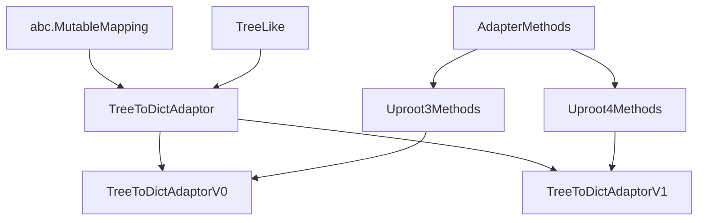
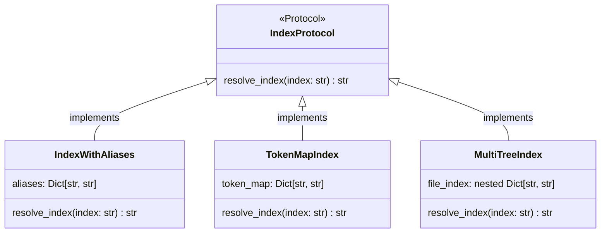
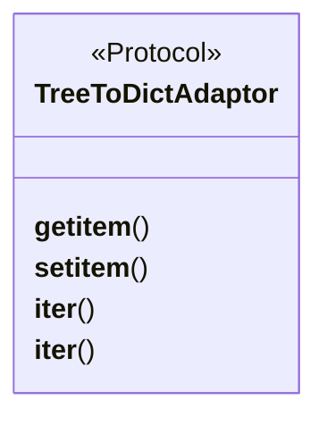
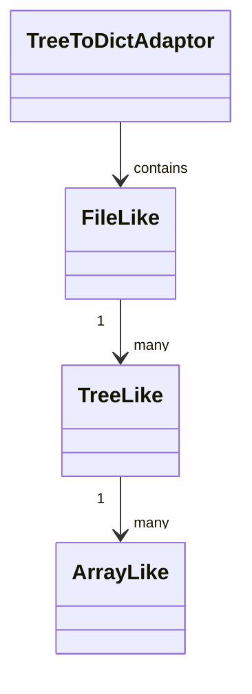

## Intro

The purpose of `fast_carpenter` is to process HEP data using standard tools.
As such most of the code consists of bridges/adapters between data import tools,
data processing tools, data export tools and various other tools for tasks in between.

